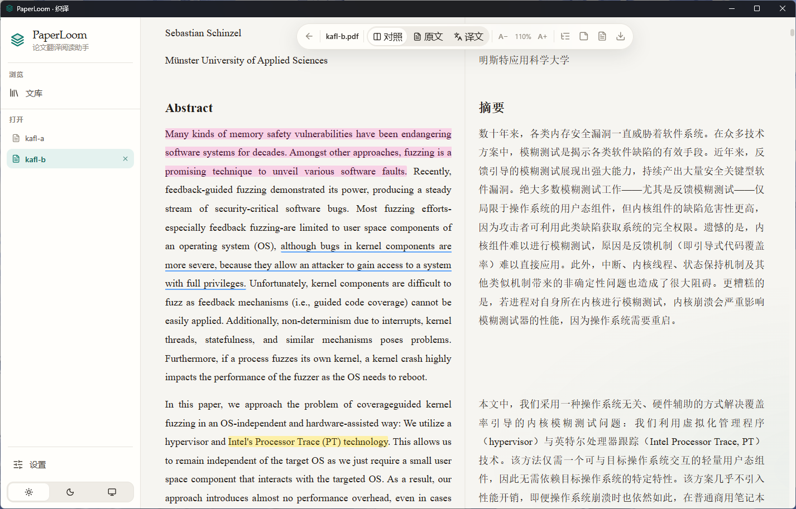

<div align="center">

# PaperLoom

**An AI-powered paper translation tool**

Turn paper PDFs into structured web pages, translate them with an LLM,
and read the original and the translation side by side.

🔒 Runs entirely on your machine · Your documents and API key never leave your computer

[](https://www.python.org/) [](https://fastapi.tiangolo.com/) [](https://react.dev/) [](https://www.typescriptlang.org/) [](https://tailwindcss.com/) [](https://www.electronjs.org/) [](LICENSE)

[中文](README.md) · [English](README.en.md)

[](https://github.com/tsukii12/paperloom/releases/latest)



</div>

---

## 🆕 What's New in 0.8.6

- Fixed failure to start after an all-users install under `Program Files`, where the old data path was not writable
- Data now defaults to `%LOCALAPPDATA%\PaperLoom\data`, outside the replaceable application directory
- The Settings page can migrate or switch the data directory and open the current location in File Explorer
- Highlights, underlines, and notes now work on both source and translated text; the selection toolbar stays on one line
- The library now has a collapsible sidebar, floating controls, pagination, and document renaming
- Multi-document conversion and translation use an explicit queued state, with more reliable live refresh
- Model connection tests use the current unsaved form values and correctly reject empty or incompatible responses
- The About page now shows the version and a link to the GitHub repository; current version: **0.8.6**

## ✨ Features

### 📄 Parsing & Translation

- **Two engines** — Docling (light and fast) or MinerU (best for academic layouts), switchable anytime
- **On-demand install** — engines bundle PyTorch and total several GB, so they are **not shipped inside the installer**;
  one click downloads them into a user-writable directory
- **Structure-aware parsing** — figures and tables stay inline at their original reading position; formulas render as LaTeX
- **Any OpenAI-compatible API** — OpenAI, DeepSeek, GLM, Qwen, Kimi, SiliconFlow, StepFun, …
- **Batched concurrent translation** — configurable concurrency and reasoning effort, formula placeholder protection,
  automatic retry for failed blocks, incremental persistence so progress is visible as it happens

### 📖 Reading

- **Side-by-side view** — blocks aligned row by row, with a hairline down the middle like an open book; toggle original / translation / both
- **Paper fonts** — choose separate typefaces for CJK and Latin, applied to the paper body only, never to the UI
- **Annotations** — select source or translated text to highlight (4 colors), underline, or attach a note; the side panel lists them all with jump-to-source
- **Selection translate** — select text and hit translate for an instant popup
- **Image lightbox** — click to zoom, `←` `→` to browse, save with one click
- **Export** — standalone HTML (single-file) or **Save as PDF** (printed via headless Edge/Chrome:
  real selectable vector text, no print dialog)

### 🗂️ Management

- **Library** — file-manager style navigation: double-click to enter folders, breadcrumbs, go up one level,
  rename / move documents and folders, nested folders, pagination, multi-select batch operations, drag-and-drop filing
- **Search** — searches across every folder, results show their folder path as a clickable chip
- **Appearance** — collapsible sidebar; light / dark / follow-system; five accent colors plus a custom color picker; UI scale 90%–125%
- **Download sources** — engine packages from a PyPI mirror (Tsinghua by default), models from
  hf-mirror / ModelScope / HuggingFace
- **Processing log** — click the status pill to see the full conversion / translation log

## 🚀 Quick Start

> Requires [uv](https://docs.astral.sh/uv/) (manages Python 3.12) and Node.js 20+

```bash
# 1️⃣ Python environment
uv venv .venv --python 3.12
uv pip install --python .venv/Scripts/python.exe -r requirements.txt

# 2️⃣ Build the frontend
cd web && npm install && npm run build && cd ..

# 3️⃣ Run (opens your browser automatically)
.venv/Scripts/python.exe run.py
```

Then open <http://127.0.0.1:8686>.

> 💡 For frontend development, run `cd web && npm run dev` — `/api` is already proxied to port 8686, with hot reload.

> ⚠️ The commands above use Windows paths (`.venv/Scripts/python.exe`).
> On macOS or Linux, use `.venv/bin/python`.

## 🧭 Workflow

| Step | What to do |
| --- | --- |
| 1️⃣ Install an engine | Settings → Conversion Engines → **Download & Install** (about 1 GB the first time) |
| 2️⃣ Upload | Drag PDFs into the library — multiple at once, or straight into a folder |
| 3️⃣ Convert | Hit **Convert**. The parsing models download on first use |
| 4️⃣ Configure the API | Settings → Translation API: Base URL, API key, model name; use **Test connection** |
| 5️⃣ Translate | Hit **Translate**; click the status pill for a live log |
| 6️⃣ Read | Hit **Read** for the side-by-side view |

## 🖥️ Desktop App

Inside `desktop/electron/`:

```bash
npm install          # skip if already installed
npm run start        # dev mode: boots the backend and opens a desktop window
npm run dist         # build an NSIS installer → ../dist-electron/
```

**The installer ships no conversion engines.** Bundling them would push it past 400 MB. It carries only
Electron + a Python runtime + the base dependencies (FastAPI / uvicorn / httpx and friends, ~15 MB),
for a **~144 MB** installer. On first use, download an engine from *Settings → Conversion Engines*;
it lands in `%LOCALAPPDATA%\PaperLoom\data\engines\<engine>` and is added to `sys.path` / `PYTHONPATH`,
so both the backend process and the conversion worker subprocess can import it — no restart needed.

Building requires `.venv-base`, a minimal environment with only the base dependencies:

```bash
uv venv .venv-base --python 3.12
uv pip install --python .venv-base/Scripts/python.exe fastapi "uvicorn[standard]" python-multipart httpx truststore
```

The installer defaults to per-user installation (`perMachine=false`). Data lives in
`%LOCALAPPDATA%\PaperLoom\data` by default and can be migrated to another drive from Settings;
upgrading the application does not remove it.
`desktop/vc-runtime/` carries the VC++ runtime DLLs that get copied into `torch/lib` after an engine
install, working around `WinError 1114` on older systems.

## 📁 Project Layout

```
paperloom/
├─ server/                  # FastAPI backend
│  ├─ app.py                # routes + static hosting + on-demand engine install
│  ├─ db.py                 # SQLite (doc metadata, annotations, folder tree)
│  ├─ jobs.py               # dual-channel background queues (convert / translate, cancellable)
│  ├─ converter/            # engine adapters, all emitting a unified Block model
│  │  ├─ base.py            # Block definition + engine dispatch
│  │  ├─ docling_backend.py / docling_worker.py
│  │  └─ mineru_backend.py
│  ├─ render.py             # blocks → standalone HTML
│  ├─ translator.py         # OpenAI-compatible batched translation
│  └─ settings.py           # persists data/settings.json
├─ web/                     # React + TS + Tailwind frontend
│  ├─ src/pages/            # Documents (library) / Reader / Settings
│  ├─ src/components/       # Dropdown / MoveDialog / ThemeSwitch / BrandMark …
│  └─ src/theme.ts          # theme, accent color, paper fonts, UI scale
├─ desktop/
│  ├─ electron/             # main.js + electron-builder config
│  └─ vc-runtime/           # bundled VC++ runtime (fixes torch loading on older systems)
├─ docs/UI-REDESIGN.md      # UI design specification
├─ scripts/mock_llm.py      # mock LLM for development (exercises the pipeline, no real translation)
└─ run.py                   # one-command launcher
```

## 🏗️ Design Notes

- **Engines are decoupled from the app** — `converter/__init__.py` is empty, and docling / mineru are
  imported lazily, inside functions and inside the worker subprocess. That means **the app starts fine
  with no engine installed**, only prompting you to install one when you convert — which is also what
  keeps the installer down to 144 MB.
- **Where engines live** — `%LOCALAPPDATA%\PaperLoom\data\engines\<engine>` (or the custom data directory), installed by the bundled `uv` via
  `uv pip install --target`. Each engine gets its own directory and resolves its own dependencies, so
  they never interfere with each other.
- **Path injection** — at startup the engine directories are added to `sys.path` and `PYTHONPATH`.
  Conversion workers are `sys.executable` subprocesses that inherit `os.environ`, so one setting covers
  everything and no restart is needed after an install.
- **Loopback only** — binds to 127.0.0.1, and CORS only allows local origins.

## ⚠️ Notes & Caveats

- 🔑 **API key storage** — stored in plaintext as `settings.json` inside the active data directory (local machine only, loopback
  interface only). `data/` is gitignored — **never commit it to a public repo**.
- 🗑️ **Delete means back up** — deleting a document moves it to `data/trash/` rather than removing it.
- 🧩 **VC++ runtime** — `torch`'s `c10.dll` needs a recent VC++ runtime; older systems raise
  `WinError 1114`. The desktop build ships the DLLs and copies them into `torch/lib` automatically.
  When running from source, install the
  [VC++ 2015-2022 Redistributable](https://aka.ms/vs/17/release/vc_redist.x64.exe).
- ⏳ **First conversion is slow** — it downloads the parsing models (a few hundred MB for Docling).
- 🖨️ **PDF export takes a while** — roughly 25–60 seconds for a figure-heavy paper; the bottleneck is
  the headless browser layout itself.

## 👥 Contributors

- **Tsuki** — project inception, requirements, testing and acceptance
- **Codex** (OpenAI) — architecture, frontend and backend implementation, desktop packaging and debugging

## 🙏 Credits

- [Docling](https://github.com/docling-project/docling) / [MinerU](https://github.com/opendatalab/MinerU) — PDF parsing
- [FastAPI](https://fastapi.tiangolo.com/) · [React](https://react.dev/) · [Tailwind CSS](https://tailwindcss.com/) · [Electron](https://www.electronjs.org/) · [KaTeX](https://katex.org/)

## 📜 License

[MIT](LICENSE) © 2026 Tsuki
